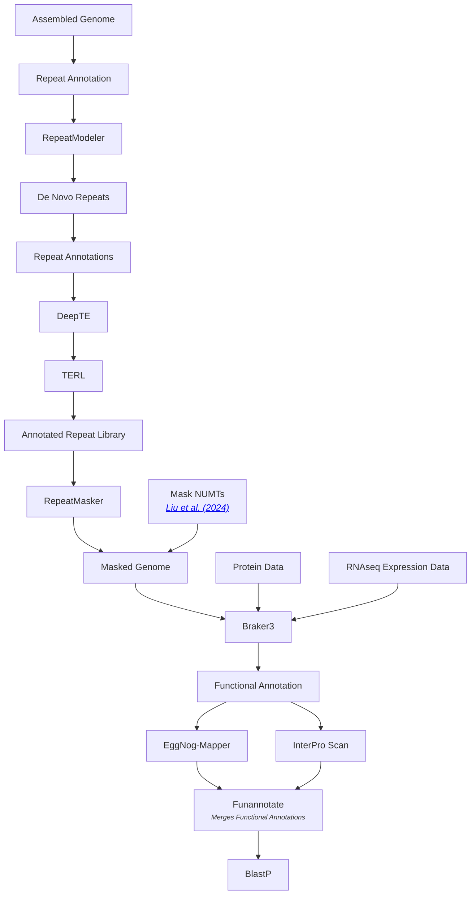
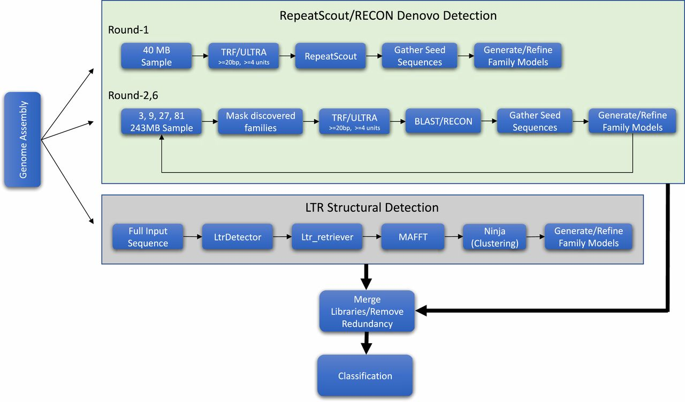

# A Genome Assembly and Annotation Workflow 
#### Authored: Michael Grapin -- Moore Lab Research Technician @ University of Nebraska-Lincoln 

## Purpose of the Repository: 
This repository is meant to provide others out there with informative guide to genome assembly and annotation. This is no means exhuastive but a starting point based on my learned experience. 

## Outline: 
* Annotation
	* Annotating Our Genome
		- The Goal of Annotation
	* Repeat Masking
		- [RepeatModeler](https://github.com/Dfam-consortium/RepeatModeler) 
		- [RepeatMasker](https://github.com/Dfam-consortium/RepeatMasker) 
		- Using the[Dfam](https://www.dfam.org/home) database
		- Machine Learning to Classify Transposable Elements
			- Tutorial: [Repeat-annotation-pipeline](https://github.com/pedronachtigall/Repeat-annotation-pipeline)
			- [DeepTE](https://github.com/LiLabAtVT/DeepTE)
			- [TERL](https://github.com/muriloHoracio/TERL)
		- Script: RepeatMM.sh
	* Structural Annotation 
		- Prepapring Your RNAseq Data
		- [Braker3](https://github.com/Gaius-Augustus/BRAKER)
		- Script(s): 
	* Funnctional Annotation
		- In Processs....
		

---

# Annotation 



## Repeat Masking 

### Thoughts on Identifying and Modeling Repeative Elements in a Non-Model Organism

### Repeat Modeler
  
**Figure 1.** [RepeatModeler2 for automated genomic discovery of transposable element families](https://doi.org/10.1073/pnas.1921046117) 

> Repeat Modeler (De Novo Repeat Finder) -> Repeat Classifer (Module of Repeat Modeler for Classifications) -> Calls Repeat Masker (Housing the Repeat Librarys) -> Generates a Classification for the conseni.fa 


* ```Repeat Classifer```  
Pulling repeats from Dfam to give our classification more records. This involves querying and downloading the repective records from Dfam and then formating them to a fasta format, then telling ```RepeatClassifer``` to use your new repeats library. 

### Running through this example 
1.) Obtain a copy of Repeat Modeler and Repeat Masker

```
# Check the Version to make sure its the latest release
mamba install bioconda::repeatmodeler
```


2.) Download the Dfam data
- Method 1: Go to [Dfam](https://www.dfam.org/releases/current/families/) and download what your need
``` bash 
wget https://www.dfam.org/releases/current/families/Dfam-curated_only-1.embl.gz
```

Then Set the PERL5LIB Environment Variable 

- The most robust and clean solution is to use the PERL5LIB environment variable, which tells the Perl interpreter where to look for modules *in addition* to its default paths. This method avoids modifying the package files.
```bash 
 # Activate your Conda environment:
   conda activate your\_repeatmasker\_env

 # Set the PERL5LIB variable: You need to explicitly point to the directory containing EMBL.pm.  
 # Use the base directory of your Conda environment for the path below:  
   export PERL5LIB="<PATH TO REPEATMASKER CONDA>/share/RepeatMasker:$PERL5LIB"

# Run the script: The buildRMLibFromEMBL.pl script should now execute successfully.  
   buildRMLibFromEMBL.pl dfam.embl > dfam.fa
```

- Method 2: Download the [Famdb](https://www.dfam.org/releases/current/families/FamDB/) partition(s) you want and query with famdb.py 
```python
# Example famdb.py query 
python famdb.py -i <PATH TO LOCAL HD5 DB> families ...
```
- See [Famdb documentations](https://github.com/Dfam-consortium/FamDB) for full usage

3.) Edit ```RepeatClassifer``` perl script to have the new path of your local RepeatsMasker.lib and RepeatPeps.lib
```perl
 # ~ Line 200
my $TE_PROTEIN_LIB = "<PATH>/RepeatPeps.lib";
my $TE_CONSENSUS_LIB = "<PATH>/RepeatMasker.lib";
```

### Optimizing the Repeat Annotations 
RepeatModelers is fairly slow because some of the programs in the pipeline are single threaded. This doesn't allow for use to have much throughput when search large genomes. I was was searching this out and came across this [issue](https://github.com/Dfam-consortium/RepeatModeler/issues/40#issuecomment-527565134) and the authors advice was to increase the number of rounds.    

The thought is by increasing the number of rounds then we will gain more coverage, but there is a a trade off for computational power/time. 


### Repeat Maskering 

* Questions about flags: 
	- Should we include the ```-nolow``` flag? 
	- how do we get values for flags such as ```-div``` and ```-cutoff```? 
	- Should we vary these paramters because I think no low will make a difference? 

* There parameters are approiate. 


### Masking NUMTs 
- NUMTs (Nuclear Mitochondrial DNA segments) are fragments of mitochondrial DNA that have been transferred and integrated into the nuclear genome. These sequences are common in eukaryotic genomes and are typically assumed to be non-coding.

- However, NUMTs can pose a problem in genome annotation and downstream analyses. For example, RNA-Seq reads originating from the actual mitochondrial genome might incorrectly align to NUMT regions in the nuclear genome, potentially leading to spurious gene models or confounding expression analyses. To prevent this, we soft-masked the NUMTs so that they are ignored or downweighted by gene prediction tools.

- Our strategy for detecting NUMTs followed the approach used in Liu et al. [2024, Mol Phyl Evol](https://doi.org/10.1016/j.ympev.2024.108221), a recent study on NUMTs in orthopteran genomes. We used the mitochondrial genome contig identified by MitoHiFi as a query in a BLASTn search against the nuclear genome to identify regions of high sequence similarity. We used the same BLAST parameters as described in the Liu et al. study to ensure consistency and comparability.


Want to see how many bases are soft masked between ```RepeatMasker``` and Masking NUMT's? 
```
seqkit seq -s $FASTA | grep -v '^>' | tr -cd 'a-z' | wc -c

```

## Structural Annotation 

- The first step for annotating the genome is structural annotation. Structural annotation involves using reference databases and RNA-seq data as evidence to know which parts of the genome are transcribed. It focuses on identifying and defining the physical components of the genome.

- We have used as input files here:
	- The .fasta file with our soft-masked cricket genome
	- The .bam files generated with HiSat2 from the RNA-Seq files (tissue atlas + selection line subsamples)
	- A protein .fasta file from OrthoDB. OrthoDB presents a catalog of orthologous protein-coding genes across all domains of life, so this can be helpful additional evidence to infer the coding regions of our cricket genome besides the RNA-Seq datasets. To optimize computational time, we have used specifically the [OrthoDB v12 dataset partitioned for Arthropod sequences](https://bioinf.uni-greifswald.de/bioinf/partitioned_odb12/).


## Functional Annotation 

- With the structural annotation complete, we did functional annotation. This step aimed to assign biological meaning to the predicted transcripts and proteins, such as their molecular function, cellular role, and involvement in pathways. In its essence, it is the process of attaching metadata to the transcripts identified by the structural annotation.

- Functional annotation is typically based on:
	- Sequence homology to well-characterized genes in other organisms.
	- Conserved protein domains and motifs.
	- Gene Ontology (GO) terms, KEGG pathways, or Enzyme Commission (EC) numbers.
	- Experimental evidence, when available.

- This process often involves multiple tools and can be done iteratively to improve accuracy and coverage. In our case, functional annotation was carried out using two complementary tools, ```eggnog-mapper``` and ```InterProScan```. The outputs of these tools were then integrated using ```Funannotate```, which can both perform functional annotation and merge results from multiple sources into a unified functional annotation set that also includes genomic coordinates for transcripts.

