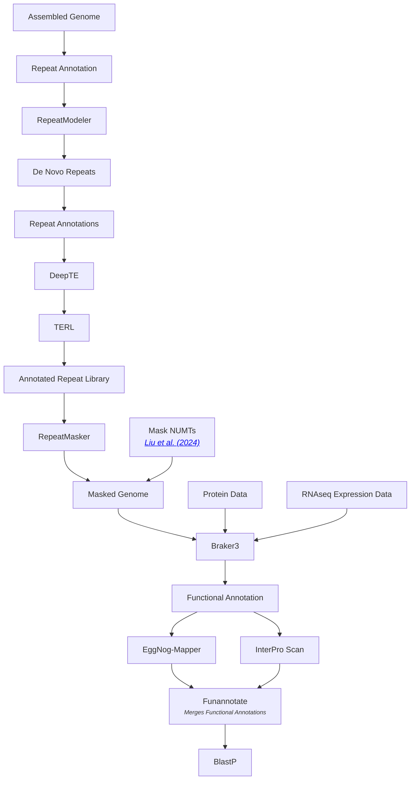
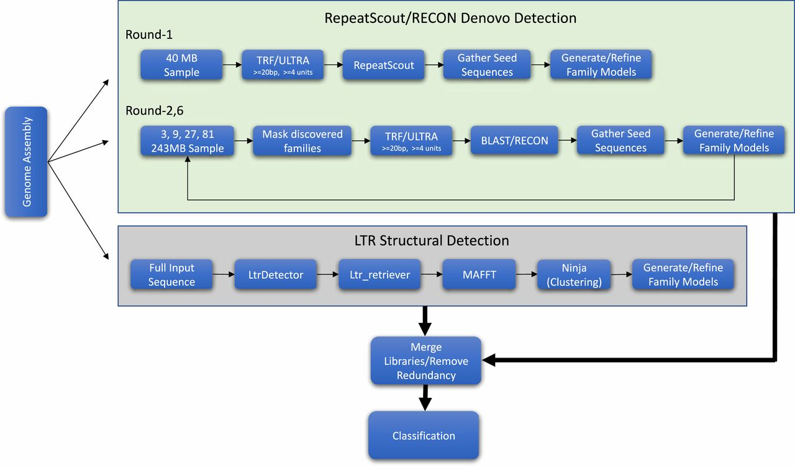

# A Genome Assembly and Annotation Workflow 
#### Authored: Michael Grapin -- Moore Lab Research Technician @ University of Nebraska-Lincoln 

## Purpose of the Repository: 
This repository is meant to provide others out there with informative guide to genome assembly and annotation. This is no means exhuastive but a starting point based on my learned experience. 

## Outline: 
* Annotation
	* Annotating Our Genome
		- The Goal of Annotation
	* Repeat Masking
		- [RepeatModeler](https://github.com/Dfam-consortium/RepeatModeler) 
		- [RepeatMasker](https://github.com/Dfam-consortium/RepeatMasker) 
		- Using the[Dfam](https://www.dfam.org/home) database
		- Machine Learning to Classify Transposable Elements
			- Tutorial: [Repeat-annotation-pipeline](https://github.com/pedronachtigall/Repeat-annotation-pipeline)
			- [DeepTE](https://github.com/LiLabAtVT/DeepTE)
			- [TERL](https://github.com/muriloHoracio/TERL)
		- Script: RepeatMM.sh
	* Structural Annotation 
		- Prepapring Your RNAseq Data
		- [Braker3](https://github.com/Gaius-Augustus/BRAKER)
		- Script(s): 
	* Funnctional Annotation
		- In Processs....
		

---

# Annotation 


```mermaid
flowchart TD; 
	Genome[Assembled Genome]-->RepeatA[Repeat Annotation];
	RepeatA-->RepeatModeler;
	RepeatModeler-->Rep[De Novo Repeats];
	Rep-->RepAA[Repeat Annotations];
	RepAA-->DeepTE;
	DeepTE-->TERL;
	TERL-->Lib[Annotated Repeat Library];
	Lib-->RepeatMasker;
	RepeatMasker-->Mask[Masked Genome];
	MaskNumts["Mask NUMTs<br><a href='https://doi.org/10.1016/j.ympev.2024.108221'><i>Liu et al. (2024)</i></a>"];
	MaskNumts-->Mask;
	Mask-->Braker3;
	Prot[Protein Data];
	RNA[RNAseq Expression Data]
	Prot-->Braker3;
	RNA-->Braker3;
	Braker3-->Fun[Functional Annotation];
	Fun-->Egg[EggNog-Mapper];
	Fun-->Inter[InterPro Scan];
	Egg-->Funannotate["Funannotate<br><div style='text-align:center; font-size:12px;'><i>Merges Functional Annotations</i></div>"];
	Inter-->Funannotate;
	Funannotate-->BlastP


```  

## Repeat Masking 

### Thoughts on Identifying and Modeling Repeative Elements in a Non-Model Organism

### Repeat Modeler
  
**Figure 1.** [RepeatModeler2 for automated genomic discovery of transposable element families](https://doi.org/10.1073/pnas.1921046117) 

> Repeat Modeler (De Novo Repeat Finder) -> Repeat Classifer (Module of Repeat Modeler for Classifications) -> Calls Repeat Masker (Housing the Repeat Librarys) -> Generates a Classification for the conseni.fa 


* ```Repeat Classifer```  
Pulling repeats from Dfam to give our classification more records. This involves querying and downloading the repective records from Dfam and then formating them to a fasta format, then telling ```RepeatClassifer``` to use your new repeats library. 

### Running through this example 
1.) Obtain a copy of Repeat Modeler and Repeat Masker

```
# Check the Version to make sure its the latest release
mamba install bioconda::repeatmodeler
```


2.) Download the Dfam data
- Method 1: Go to [Dfam](https://www.dfam.org/releases/current/families/) and download what your need
``` bash 
wget https://www.dfam.org/releases/current/families/Dfam-curated_only-1.embl.gz
```

Then Set the PERL5LIB Environment Variable 

- The most robust and clean solution is to use the PERL5LIB environment variable, which tells the Perl interpreter where to look for modules *in addition* to its default paths. This method avoids modifying the package files.
```bash 
 # Activate your Conda environment:
   conda activate your\_repeatmasker\_env

 # Set the PERL5LIB variable: You need to explicitly point to the directory containing EMBL.pm.  
 # Use the base directory of your Conda environment for the path below:  
   export PERL5LIB="<PATH TO REPEATMASKER CONDA>/share/RepeatMasker:$PERL5LIB"

# Run the script: The buildRMLibFromEMBL.pl script should now execute successfully.  
   buildRMLibFromEMBL.pl dfam.embl > dfam.fa
```

- Method 2: Download the [Famdb](https://www.dfam.org/releases/current/families/FamDB/) partition(s) you want and query with famdb.py 
```python
# Example famdb.py query 
python famdb.py -i <PATH TO LOCAL HD5 DB> families ...
```
- See [Famdb documentations](https://github.com/Dfam-consortium/FamDB) for full usage

3.) Edit ```RepeatClassifer``` perl script to have the new path of your local RepeatsMasker.lib and RepeatPeps.lib
```perl
 # ~ Line 200
my $TE_PROTEIN_LIB = "<PATH>/RepeatPeps.lib";
my $TE_CONSENSUS_LIB = "<PATH>/RepeatMasker.lib";
```

### Optimizing the Repeat Annotations 
RepeatModelers is fairly slow because some of the programs in the pipeline are single threaded. This doesn't allow for use to have much throughput when search large genomes. I was was searching this out and came across this [issue](https://github.com/Dfam-consortium/RepeatModeler/issues/40#issuecomment-527565134) and the authors advice was to increase the number of rounds.    

The thought is by increasing the number of rounds then we will gain more coverage, but there is a a trade off for computational power/time. 


### Repeat Maskering 

* Questions about flags: 
	- Should we include the ```-nolow``` flag? 
	- how do we get values for flags such as ```-div``` and ```-cutoff```? 
	- Should we vary these paramters because I think no low will make a difference? 

* There parameters are approiate. 


### Masking NUMTs 
- NUMTs (Nuclear Mitochondrial DNA segments) are fragments of mitochondrial DNA that have been transferred and integrated into the nuclear genome. These sequences are common in eukaryotic genomes and are typically assumed to be non-coding.

- However, NUMTs can pose a problem in genome annotation and downstream analyses. For example, RNA-Seq reads originating from the actual mitochondrial genome might incorrectly align to NUMT regions in the nuclear genome, potentially leading to spurious gene models or confounding expression analyses. To prevent this, we soft-masked the NUMTs so that they are ignored or downweighted by gene prediction tools.

- Our strategy for detecting NUMTs followed the approach used in Liu et al. [2024, Mol Phyl Evol](https://doi.org/10.1016/j.ympev.2024.108221), a recent study on NUMTs in orthopteran genomes. We used the mitochondrial genome contig identified by MitoHiFi as a query in a BLASTn search against the nuclear genome to identify regions of high sequence similarity. We used the same BLAST parameters as described in the Liu et al. study to ensure consistency and comparability.


Want to see how many bases are soft masked between ```RepeatMasker``` and Masking NUMT's? 
```
seqkit seq -s $FASTA | grep -v '^>' | tr -cd 'a-z' | wc -c

```

## Structural Annotation 

- The first step for annotating the genome is structural annotation. Structural annotation involves using reference databases and RNA-seq data as evidence to know which parts of the genome are transcribed. It focuses on identifying and defining the physical components of the genome.

- We have used as input files here:
	- The .fasta file with our soft-masked cricket genome
	- The .bam files generated with HiSat2 from the RNA-Seq files (tissue atlas + selection line subsamples)
	- A protein .fasta file from OrthoDB. OrthoDB presents a catalog of orthologous protein-coding genes across all domains of life, so this can be helpful additional evidence to infer the coding regions of our cricket genome besides the RNA-Seq datasets. To optimize computational time, we have used specifically the [OrthoDB v12 dataset partitioned for Arthropod sequences](https://bioinf.uni-greifswald.de/bioinf/partitioned_odb12/).


## Functional Annotation 

- With the structural annotation complete, we did functional annotation. This step aimed to assign biological meaning to the predicted transcripts and proteins, such as their molecular function, cellular role, and involvement in pathways. In its essence, it is the process of attaching metadata to the transcripts identified by the structural annotation.

- Functional annotation is typically based on:
	- Sequence homology to well-characterized genes in other organisms.
	- Conserved protein domains and motifs.
	- Gene Ontology (GO) terms, KEGG pathways, or Enzyme Commission (EC) numbers.
	- Experimental evidence, when available.

- This process often involves multiple tools and can be done iteratively to improve accuracy and coverage. In our case, functional annotation was carried out using two complementary tools, ```eggnog-mapper``` and ```InterProScan```. The outputs of these tools were then integrated using ```Funannotate```, which can both perform functional annotation and merge results from multiple sources into a unified functional annotation set that also includes genomic coordinates for transcripts.

### ```eggnog-mapper```
* Running ```eggnog-mapper``` on (http://eggnog-mapper.embl.de/) becuase software requirements and dependencies for  ```eggnog-mapper``` tend to be fickle to set up. Since I am only using it for these two instances I am avoiding the setup. 


### ```InterProScan```
* Running ```InterProScan``` on [Galaxy](https://usegalaxy.org/) becuase software requirements and dependencies for  ```InterProScan``` tend to be fickle to set up. Since I am only using it for these two instances I am avoiding the setup. 

* **```InterProScan```** requireds asterisks (*) to be removed prior to the run. I did this like so:
```sed 's/\*//g' braker.aa > braker.aa.NoStop```

* Select the **XML** output format option for later use with ```Funannotate```  


### ```Funannotate```


**Message From Conda install**: You will have to do this instructions. 
```
##########################################################################################
All Users:
  You will need to setup the funannotate databases using funannotate setup.
  The location of these databases on the file system is your decision and the
  location can be defined using the FUNANNOTATE_DB environmental variable.

  To set this up in your conda environment you can run the following:
    echo "export FUNANNOTATE_DB=/your/path" > /mnt/nrdstor/moorelab/mgrapin2/funannotate/etc/conda/activate.d/funannotate.sh
    echo "unset FUNANNOTATE_DB" > /mnt/nrdstor/moorelab/mgrapin2/funannotate/etc/conda/deactivate.d/funannotate.sh

  You can then run your database setup using funannotate:
    funannotate setup -i all

  Due to licensing restrictions, if you want to use GeneMark-ES/ET, you will need to install manually:
  download and follow directions at http://topaz.gatech.edu/GeneMark/license_download.cgi
  ** note you will likely need to change shebang line for all perl scripts:
    change: #!/usr/bin/perl to #!/usr/bin/env perl


Mac OSX Users:
  Augustus and Trinity cannot be properly installed via conda/bioconda at this time. However,
  they are able to be installed manually using a local copy of GCC (gcc-8 in example below).

  Install augustus using this repo:
    https://github.com/nextgenusfs/augustus

  To install Trinity v2.15.2, download the source code and compile using GCC/G++:
    wget https://github.com/trinityrnaseq/trinityrnaseq/releases/download/Trinity-v2.15.2/trinityrnaseq-v2.15.2.FULL.tar.gz
    tar xzvf trinityrnaseq-v2.15.2.FULL.tar.gz
    cd trinityrnaseq-v2.15.2
    make CC=gcc-8 CXX=g++-8
    echo "export TRINITY_HOME=/your/path" > /mnt/nrdstor/moorelab/mgrapin2/funannotate/etc/conda/activate.d/trinity.sh
    echo "unset TRINITY_HOME" > /mnt/nrdstor/moorelab/mgrapin2/funannotate/etc/conda/deactivate.d/trinity.sh

##########################################################################################
```

Steps to install ```Funannotate``` databases: 
```
To set this up in your conda environment you can run the following:
    echo "export FUNANNOTATE_DB=/your/path" > /conda path/etc/conda/activate.d/funannotate.sh
    echo "unset FUNANNOTATE_DB" > /conda path/etc/conda/deactivate.d/funannotate.sh

  You can then run your database setup using funannotate:
    funannotate setup -i all
	# Does not install specific busco lineages by default (insecta_odb9) 
	funannotate setup -b insecta

```

---

# Uploading a Genome Submussion To NCBI 


## Table2asn command line arguements

1.) Download table2asn from NCBI [FTP](https://ftp.ncbi.nlm.nih.gov/asn1-converters/by_program/table2asn/)
2.) unzip it (Note: linux verision I inlcude gunzip -f)
3.) Set permissions to exclutable 
4.) ./table2asn -h 

Arguements Needed for our submission: 
```
# Orginal command run 
./table2asn -i Gpenn.fsa -outdir OUTPUT -t template.sbt -f Gryllus_pennsylvanicus_blast.gff3 -euk -M n -j "[organism=Gryllus pennsylvanicus]" -J -c w -locus-tag-prefix ACWDOJ -V b -Z
```

```
./table2asn -i <Infile.fsa> -outdir <$OUTDIR> -t <template.sbt> -f <gff or annotations.tbl> \
-euk -M n -j "[organism=<species taxa name>]" -J -c w -locus-tag-prefix <locus tag prefix> -V b -Z

-i <File_In>
   Single Input File

 -outdir <File_Out>
   Path to results

-t <File_In>
   Template File

-f <File_In>
   Single 5 column table file or other annotations

-linkage-evidence-file <File_In>
   File listing linkage evidence for gaps of different lengths

-euk
   Assume eukaryote, and create missing mRNA features

-M <String>
   Master Genome Flags
         n Normal
         t TSA

-j <String>
   Source Qualifiers.
   These qualifier values override any conflicting values read from a file
   (See -src-file)

-Z
   Output discrepancy report
```


Complete List: Current as 11/17/2025  
```
table2asn.exe -help
USAGE
  table2asn [-h] [-help] [-help-full] [-xmlhelp] [-indir Directory]
    [-outdir Directory] [-E] [-x String] [-i InFile] [-aln-file InFile]
    [-aln-gapchar STRING] [-aln-missing STRING] [-aln-alphabet STRING]
    [-o OutFile] [-out-suffix String] [-binary] [-t InFile] [-a String] [-J]
    [-A String] [-C String] [-j String] [-src-file InFile] [-accum-mods]
    [-y String] [-Y InFile] [-D InFile] [-f InFile] [-V String] [-q] [-U] [-T]
    [-P] [-W] [-K] [-H String] [-Z] [-split-dr] [-c String] [-z OutFile]
    [-N String] [-w InFile] [-M String] [-l String]
    [-linkage-evidence-file InFile] [-gap-type String] [-m String]
    [-ft-url String] [-ft-url-mod String] [-gaps-min Integer]
    [-gaps-unknown Integer] [-postprocess-pubs] [-locus-tag-prefix String]
    [-no-locus-tags-needed] [-euk] [-suspect-rules String] [-allow-acc]
    [-intronless] [-refine-prt-alignments]
    [-prt-alignment-filter-query String] [-logfile LogFile] [-logxml LogFile]
    [-split-logs] [-verbose] [-huge] [-disable-huge] [-usemt String] [-r]
    [-genbank] [-gb-method GBMethod] [-gb-snp enable] [-gb-wgs enable]
    [-gb-cdd enable] [-vdb] [-novdb] [-vdb-path Path] [-sra] [-sra-acc AddSra]
    [-sra-file AddSra] [-fetchall] [-conffile File_Name] [-version]
    [-version-full] [-version-full-xml] [-version-full-json]

DESCRIPTION
   Converts files of various formats to ASN.1

OPTIONAL ARGUMENTS
 -h
   Print USAGE and DESCRIPTION;  ignore all other parameters
 -help
   Print USAGE, DESCRIPTION and ARGUMENTS; ignore all other parameters
 -help-full
   Print USAGE, DESCRIPTION and ARGUMENTS, including hidden ones; ignore all
   other parameters
 -xmlhelp
   Print USAGE, DESCRIPTION and ARGUMENTS in XML format; ignore all other
   parameters
 -indir <File_In>
   Path to input files
 -outdir <File_Out>
   Path to results
 -E
   Recurse
 -x <String>
   Suffix
   Default = `.fsa'
 -i <File_In>
   Single Input File
    * Incompatible with:  aln-file
 -aln-file <File_In>
   Alignment input file
    * Incompatible with:  i
 -aln-gapchar <String>
   Alignment missing indicator
   Default = `-'
 -aln-missing <String>
   Alignment missing indicator
   Default = `'
 -aln-alphabet <String, `nuc', `prot'>
   Alignment alphabet
   Default = `prot'
 -o <File_Out>
   Single Output File
 -out-suffix <String>
   ASN.1 files suffix
   Default = `.sqn'
 -binary
   Output binary ASN.1
 -t <File_In>
   Template File
 -a <String>
   File Type
         a Any
         s FASTA Set
         d FASTA Delta, di FASTA Delta with Implicit Gaps
         z FASTA with Gap Lines
   Default = `a'
 -J
   Delayed Genomic Product Set
 -A <String>
   Accession
 -C <String>
   Genome Center Tag
 -j <String>
   Source Qualifiers.
   These qualifier values override any conflicting values read from a file
   (See -src-file)
 -src-file <File_In>
   Single source qualifiers file. The qualifiers in this file override any
   conflicting qualifiers automically read from a .src file, which, in turn,
   take precedence over source qualifiers specified in a fasta defline
 -accum-mods
   Accumulate non-conflicting modifier values from different sources. For
   example, with this option, a 'note' modifier specified on the command line
   no longer overwrites a 'note' modifier read from a .src file. Both notes
   will appear in the output ASN.1. If modifier values conflict, the rules of
   precedence specified above apply
 -y <String>
   Comment
 -Y <File_In>
   Comment File
 -D <File_In>
   Descriptors File
 -f <File_In>
   Single 5 column table file or other annotations
 -V <String>
   Verification (combine any of the following letters)
         v Validate with Normal Stringency
         b Generate GenBank Flatfile
         t Validate with TSA Check
 -q
   Seq ID from File Name
 -U
   Remove Unnecessary Gene Xref
 -T
   Remote Taxonomy Lookup
 -P
   Remote Publication Lookup
 -W
   Log Progress
 -K
   Save Bioseq-set
 -H <String>
   Hold Until Publish
         y Hold for One Year
         mm/dd/yyyy
 -Z
   Output discrepancy report
 -split-dr
   Create unique discrepancy report for each output file
 -c <String>
   Cleanup (combine any of the following letters)
         b Basic cleanup (default)
         e Extended cleanup
         f Fix product names
         s Add exception to short introns
         w WGS cleanup (only needed when using a GFF3 file)
         d Correct Collection Dates (assume month first)
         D Correct Collection Dates(assume day first)
         x Extend ends of features by one or two nucleotides to abut gaps or
   sequence ends
         - avoid cleanup
 -z <File_Out>
   Cleanup Log File
 -N <String>
   Project Version Number
 -w <File_In>
   Single Structured Comment File
 -M <String>
   Master Genome Flags
         n Normal
         t TSA
 -l <String>
   Add type of evidence used to assert linkage across assembly gaps. May be
   used multiple times. Must be one of the following:
         paired-ends
         align-genus
         align-xgenus
         align-trnscpt
         within-clone
         clone-contig
         map
         strobe
         unspecified
         pcr
         proximity-ligation
 -linkage-evidence-file <File_In>
   File listing linkage evidence for gaps of different lengths
 -gap-type <String>
   Set gap type for runs of Ns. Must be one of the following:
         scaffold
         short-arm
         heterochromatin
         centromere
         telomere
         repeat
         contamination
         contig
         unknown (obsolete)
         fragment
         clone
         other (for future use)
 -m <String>
   Lineage to use for Discrepancy Report tests
 -ft-url <String>
   FileTrack URL for the XML file retrieval
 -ft-url-mod <String>
   FileTrack URL for the XML file base modifications
 -gaps-min <Integer>
   minimum run of Ns recognised as a gap
 -gaps-unknown <Integer>
   exact number of Ns recognised as a gap with unknown length
 -postprocess-pubs
   Postprocess pubs: convert authors to standard
 -locus-tag-prefix <String>
   Add prefix to locus tags in annotation files
 -no-locus-tags-needed
   Submission data does not require locus tags
 -euk
   Assume eukaryote, and create missing mRNA features
 -suspect-rules <String>
   Path to a file containing suspect rules set. Overrides environment variable
   PRODUCT_RULES_LIST
 -allow-acc
   Allow accession recognition in sequence IDs. Default is local
 -intronless
   Intronless alignments
 -refine-prt-alignments
   Refine ProSplign aligments when processing .prt input
 -prt-alignment-filter-query <String>
   Filter query string for .prt alignments
 -logfile <File_Out>
   Error Log File
    * Incompatible with:  logxml
 -logxml <File_Out>
   XML Error Log File
    * Incompatible with:  logfile
 -split-logs
   Create unique log file for each output file
 -verbose
   Be verbose on reporting
 -huge
   Execute in huge-file mode
    * Incompatible with:  disable-huge
 -disable-huge
   Explicitly disable huge-files mode
    * Incompatible with:  huge
 -usemt <String>
   Try to use as many threads as:
         one
         two
         many
 -version
   Print version number;  ignore other arguments
 -version-full
   Print extended version data;  ignore other arguments
 -version-full-xml
   Print extended version data in XML format;  ignore other arguments
 -version-full-json
   Print extended version data in JSON format;  ignore other arguments

 *** Data source and object manager options
 -r
   Enable remote data retrieval
 -genbank
   Enable remote data retrieval using the Genbank data loader
 -gb-method <String>
   Semicolon-separated list of Genbank loader method(s)
    * Requires:  genbank
 -gb-snp <Boolean>
   Genbank SNP processor
    * Requires:  genbank
 -gb-wgs <Boolean>
   Genbank WGS processor
    * Requires:  genbank
 -gb-cdd <Boolean>
   Genbank SNP processor
    * Requires:  genbank
 -vdb
   Use VDB data loader.
    * Incompatible with:  novdb
 -novdb
   Do not use VDB data loader.
    * Incompatible with:  vdb
 -vdb-path <String>
   Root path for VDB look-up
 -sra
   Add the SRA data loader with no options.
    * Incompatible with:  sra-acc, sra-file
 -sra-acc <String>
   Add the SRA data loader, specifying an accession.
    * Incompatible with:  sra, sra-file
 -sra-file <String>
   Add the SRA data loader, specifying an sra file.
    * Incompatible with:  sra, sra-acc

 *** General application arguments
 -fetchall
   Search data in all available databases
 -conffile <File_In>
   Program's configuration (registry) data file
   Default = `table2asn.conf'
```

---


