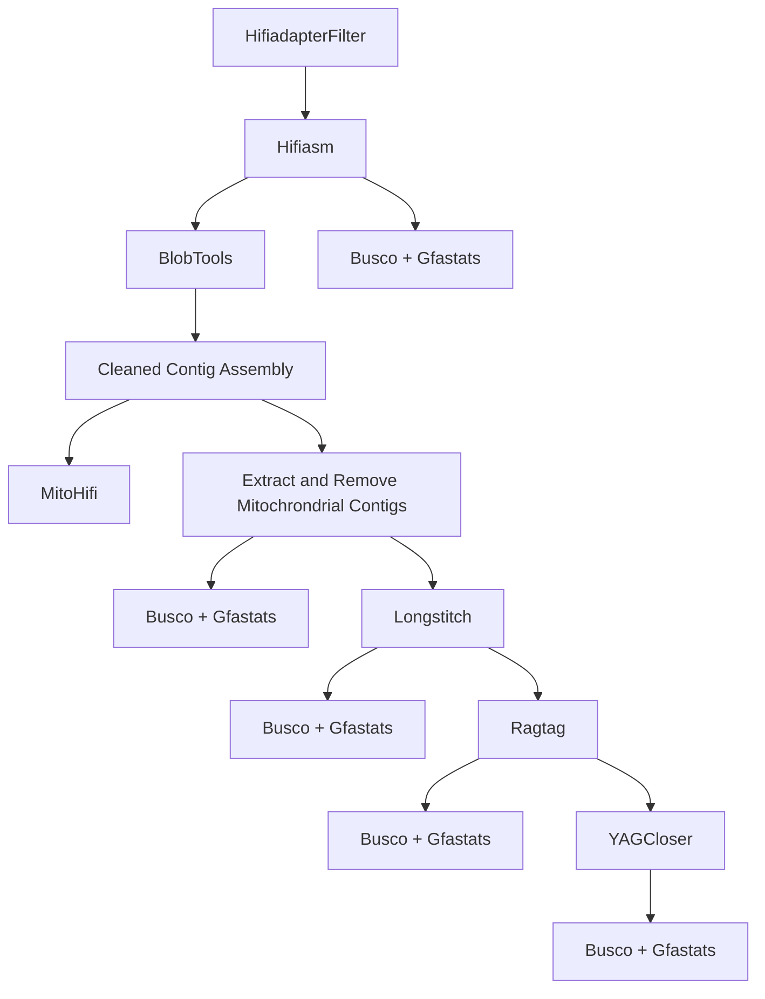

# A Genome Assembly and Annotation Workflow 
#### Authored: Michael Grapin -- Moore Lab Research Technician @ University of Nebraska-Lincoln 

## Purpose of the Repository: 
This repository is meant to provide others out there with informative guide to genome assembly and annotation. This is no means exhuastive but a starting point based on my learned experience. 

## Outline:
* Assembly
	* Geneome Assembly
		- Using Hifiasm
		- [Hifiasm](https://github.com/chhylp123/hifiasm)
		- Script: Hifiasm.sh
	* So You Generated An Assembly
		- Quality Assessment 
			- BUSCO 
			- Merqury 
			- Quast 
			- Blobtools 
		- What Are N and L stats? 
			- N stats 
			- L stats
	* Removing Contamination
		-[Blobtools](https://github.com/genomehubs/blobtoolkit)
		- Script: Blob.sh
	* Long Read Scaffolding
		-[Longstictch Pipeline](https://github.com/bcgsc/LongStitch)
		- Script: Longstitch.sh 
	* Gap Closing with Long Reads
		- [YAGCloser](https://github.com/merlyescalona/yagcloser)
		- Script: YAGcloser.sh
	* Some More Quality Assessment
		- Personal Observations
		
		
---

## Genome Assembly
Hifiasm producs an intial contig level draft assembly. It produces a phased assembly and a both a hapolype1 and haplotype2 assemblies for diploid organisms. For the purpose of this analysis we are only continuing on with the phased assembly. 

## Removing Contanmination
Blobtools is used to remove contamination from other organisms that might have gotten into our sample. This primairly manifests itselfs as bacterial taxa that were present on the sample at the time of DNA extraction. Blobtools identifies this criteria through a blast search and plotting the GC content vs coverage. The idea is that spurious bacterial tax will have lower GC content and appear as outliners from you "blob" that would be your sampled organism. This is a iterative processs with no hard cutoff for filtering out contaminants. It is a process that we want to get it to be as good as possible without removing our own organuisms DNA. 

## Long Read Scaffolding
Scaffolding is the process of taking our contigious seqeunces (contigs) and joining them together to so that they will make a more contigious "scaffold". This process also introduces gaps (often denoted as N's) but the key is to find a balance of reducing fragmentation and adding gaps. There are a host of scaffolding programs out there, I suggest you look through [Junwei Luo et al. 2021](https://doi.org/10.1093/bib/bbab033) and [genome_assembly_tools](https://github.com/nadegeguiglielmoni/genome_assembly_tools) repository for various programs. 

Currently I only have long read data for assemble so I have decided to use a long read scaffolding approach. The softwas employed is the [Longstictch Pipeline](https://github.com/bcgsc/LongStitch). An outline of the pipeline can be seen here:  [Longstitch-Outline](diagramLS.png)  
But I suggest you read the [paper](https://doi.org/10.1186/s12859-021-04451-7) for more complete details. I decided not to run the tigmint portion of the pipeline because it was creating many fragments for my assembly. I felt this was talking a step backwards after I had just assemblied with Hifiasm, whose has a good reputation for producing a quality assembly. 


## Gap Closing 
Gap closing is the process of trying to link remaining gaps that exist in the scaffolded assembly. This to YAGcloser uses long reads to span the distance of gaps. If the long read can span the gap then it will connnect it. This is good for relatively short gaps (less than 15,000 bp on average) due to the nature of hifi reads. However I found this method to be fairly ineffective because of the longer gaps existing. 

Now that we have a chromosome level assembly I it appears that there is not enough support for gap closing. I am trying the gap closing but will likely just skip it beause its not closing any gaps with enough support. See [github issue](https://github.com/merlyescalona/yagcloser/issues/3).  


## Some Other Thoughts
The goal of all assemblies is to have a chromosome level molecule. In practicality a chromosome level assembly is not needed to functional analysis (RNAseq, QTL, etc.) but it ofter preferred when trying to demostrate a quality genome assembly. To this point we would like to get it as contigious as possible. 

Some approaches that have been presented: 

* reference free (de novo)
	- genomic map (optical, physical, or linkage map)
	- long range information (Hi-C)

* reference guided 
	- "show tiling" ([Chromosomer](https://doi.org/10.1186/s13742-016-0141-6), MUMmer)

Excerpt from [Alonge et al 2019](https://doi.org/10.1186/s13059-019-1829-6)  
> Aside from reference-free approaches, there are also a few tools available for reference-guided scaffolding [14]. For example, Chromosomer and MUMmer’s “show-tiling” utility leverage pairwise alignments to a reference genome for contig scaffolding and have been used to scaffold eukaryotic genomes [15,16,17,18]. RACA is similar, though it also requires paired-end sequencing data to aid scaffolding [19]. Finally, tools such as GOS-ASM and Ragout2 employ multiple sequence aligners to reconcile multiple, potentially diverse contig sets [20, 21]. Though reference-guided scaffolding may introduce erroneous reference bias, it is often substantially faster and less expensive than acquiring the resources for the reference-free methods outlined above. However, current tools for reference-guided scaffolding of eukaryotic genomes have notable shortcomings. Firstly, these tools depend on slower DNA aligners such as BLAST and Nucmer and accordingly require long compute times of several hours to several days for mammalian-sized genomes [22]. This is especially pronounced in tools like Ragout2 that use multiple sequence aligners, such as Cactus, that can require hundreds of CPU hours for large eukaryotic genomes [23]. These aligners are also not robust to repetitive and/or gapped alignments resulting in a significant portion of contigs being unassigned in pseudomolecules. Finally, many of these methods do not internally offer the ability to correct large-scale misassemblies frequently present in draft assemblies of eukaryotic genomes nor report any metrics on conflicts due to true biological differences in the genomes.


So which route is the best way to improve our scaffolding? I'm not exactly sure but probably some combination of each and depending on which resoures are available to your system. 


### RagTag 
[RagTag](https://github.com/malonge/RagTag) is a tool for referenc guided asemmbly. This tool superseds Ragoo which was the orginal version. It has the core utilies of **correct**, **scaffold**, **patch**, and **merge**. 

**Key Point:**  
Ragtag scaffold has confidence parameters that control for the placement of contigs/scaffolds. After reading over the original [paper](https://genomebiology.biomedcentral.com/articles/10.1186/s13059-019-1829-6#Sec13) I have decided to set a more strict limit of 0.95 confidence. 

### Approach for reference based scaffolding with Ragtag
1. Pick a suitable reference species (i.e best availdable assembly with the closest relation)
	- download the genome from NCBI 

2. Extract just the chromosomes so that we can anchor our (contigs/scaffolds) to the reference 
```
scaffoldGenome="/path to scaffolding genome/sppXXX.fasta"
genome="/path to genome/plasmid-filtered.fasta"
bioawk -c fastx '{print $name}' $scaffoldGenome > scaffold.lst

## !! You have to remove the remaining scaffolds !!

# Get the sequences of the chromosomes 
seqtk subseq $scaffoldGenome scaffold.lst > reference.fasta

```
**Some Prep I Recommend**
```
# Longstictch Output (Remove the commas of extra information)
awk '/^>/{split($0,a,","); print a[1]; next} {print}' <longstitch.fa> > Ragtag/longstitch.fa
```
** A quicker way** 
```
# keys.txt is assimilis acesssion (key) chromsome (level) (cutting the sequence_report.tsv from ncbi)
awk 'NR==FNR {map[$1]=$2; next} 
     /^>/ {
        split($0, id, "_"); 
        key = substr(id[1], 2); 
        if (key in map) 
            print ">chr_" map[key]; 
        else 
            print $0; 
        next
     } 
     {print}' keys.txt input.fasta > renamed.fasta

	# Rename to unplaced
	 sed -i 's/_RagTag/_unplaced/g' filename.txt

```

3. Run Ragtag Scaffold
```
ragtag.py scaffold $REF $QUERY -r -C -u	#set threads as needed (-t)
# recommend setting higher confidence values (0.95)
```

4. Match your places sequences to the chromosomes that they were places to
```
# Extract Chromosomes 
seqkit grep -v -n -r -p "^Chr0" ragtag.scaffold.fasta > chr.placed.fasta


# Extract Unplaced Scaffolds
cat ragtag.scaffold.apg | grep "Chr0" | cut -f 6 | grep "scaffold" > unplaced_scaffolds.txt

seqtk subseq $QUERY unplaced_scaffolds.txt > unplaced_scaffolds.fasta
```

5. Add readable chromosome names and unplaced suffixes
```bash
# keys.txt is assimilis acesssion (key) chromsome (level) (cutting the sequence_report.tsv from ncbi)
awk 'NR==FNR {map[$1]=$2; next} 
     /^>/ {
        split($0, id, "_"); 
        key = substr(id[1], 2); 
        if (key in map) 
            print ">chr_" map[key]; 
        else 
            print $0; 
        next
     } 
     {print}' keys.txt input.fasta > renamed.fasta

# add unplaced suffix to unplaced scaffolds
awk '/^>/ {print $0 "_unplaced"; next} {print}' <unplaced_scaffolds.fasta> > output.fasta

# Concatatenate the chromosomes and unplaced scaffolds 
cp chr.fasta concat/final.fasta
cat unplaced_scaffolds.fasta >> concat/final.fasta

```  
  
6. Assess genome completenesss (BUSCO, Gfastats, etc.)

**Proceed to Gap Closing with YAGcloser**


### Linkage Map 
**Specific to Gpenn and Gfirm** 
The thought with using the linkage map is that we can scaffold the genomes better based on known locations of loci. Since we did chromosome level assembly with *G.assimilis* we have a large portion (~1.86 gb) in chromosome level scaffolds. However there are quite a few remaining scaffolds that might have markers located on them. These would be candidates for futher scaffolding and potential placement. This method also acts a validation method that will check to make sure that loci are belonging to the correct chromosome. Specifically, if enough markers are present we can declare that chromosome a specific number (ex. X). 

This works by aligning our markers aganist the our new reference genome, and then relating those scaffold positions to the linkage map. 

* processing the bam file 
```samtools view -F 0x100 <bam> | cut -f 1,3,4``` (keeps only primary and unaligned)

## Purging Haplotigs 
This section discusses my reasoning why we didn't run ```purge haplotigs```. 1 First, hifiasm runs a internal purging pipeline that is suppose to resolve haplotigs fairly good. When checking with purgue haplotigs, there was a single peak. I interperted this as we only had the haloptigs. The demo for purge haplotigs clearly has a double peak, and likely was made in a time when hifiasms internal purging (or other assemblers) was not as good. However, when I did test running purge haplotigs it removed a signigigant number of contigs. This did not damage the BUSCO scores, but it did reduce the genome sizes. Specifically, for *G.pennsylvanicus* this drop the bp to below the genomescope predicted size. Which is a independent measure based on Kmer frequencies.   

My summary, we likely have some haplotigs that slipped through but at this moment it was not clear whether this was true repeative content or just haplotigs. This can be a question of future investigation when we try to interate on the assembly and get it better. But for now it is going to be good enough, so we dont get rid of information. 

## Chromosome level scaffold naming convention   

In both the cases of *G.bimaculatus* and *G.assimilis* they named there chromosomes convention in order of size (largest to smallest). Currenly, our assemblies are not at chromosomal level scaffolds for all chromosomes. (ie. there are still some unplaced scaffolds that are larger.)

| Case                    | Strategy                | Example                |
| ----------------------- | ----------------------- | ---------------------- |
| Known chromosomes       | Match to reference      | `chr1`, `chr2`, `chrX` |
| No reference            | Sort by size or linkage | `chr1`–`chrN`          |
| Unplaced                | Keep consistent suffix  | `chrUn_#`              |
| Mitochondrial / plastid | Use `chrM` / `chrC`     | `chrM`, `chrC`         |
| Multiple assemblies     | Add prefix or version   | `GaChr1_v1`            |


Assembly:
1. HifiAdapterFilter 
2. Hifiasm 
3. BlobTools + Busco + Quast (Mitochrondria is left in bc high coverage)
- Purge Haplotigs [Not including]
- MitoHifi [Pulling out other potential mitogenome fragments]
4. Longstitch (try with tigmint and without) (not using tigment) (Going to use genomescope estimate genome size for g;)
5. Ragtag 
- investigate unplaced (repeats and repeat families)
6. YAGCloser 


* Thoughts: 
	- Should I do this with just contigs? Or having already scaffolded with the longstich pipeline will that improve it? 
	answer: Do not do it with just contigs, this does not assembly as good and its could be wrong because its more referenced based. 
	- Should I test it with other species?
	answer: bimac is the best assembly that exists out there. I tested Gfirm with assimilis and longercericus and it still did not place as many scaffolds.

* Next Steps: 
	- Investigate the unplaced scaffolds (repeats, gc content, blast, linkage map)