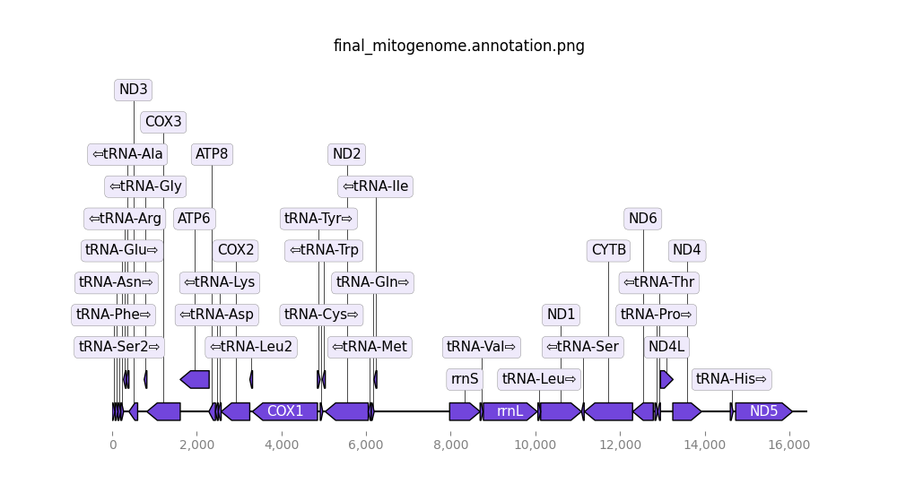

# A Genome Assembly and Annotation Workflow 
#### Authored: Michael Grapin -- Moore Lab Research Technician @ University of Nebraska-Lincoln 


## Directory Content: 
This directory contents important files and metrics for my *Gryllus pennsylvanicus* genome assembly and annotation. 

* [QC Control](#qc-control) 
* [Removing Any Remenant Adapters and Inital Filtration](#removing-any-remenant-adapters-and-inital-filtration)
* [Genome Properties](#genome-properties) 
#### Assembly
* [Inital Assembly](#inital-assembly) 
    - gfastats
* [BlobTools to Remove Contaminants](#blobtools-to-remove-contaminants) 
* [Stats Afters Contaminant Removal](#stats-afters-contaminant-removal) 
    - BUSCO 
    - gfastats 
* [Scaffolding](#scaffolding)
    - gfastats 
    - BUSCO
* [Gap Closing Stats](#gap-closing-stats) 
#### Annotation
* [Mitogenome](#mitogenome)
* [Repeat Masking](#repeatmasking)
    - Repeat Modeler 
    - DeepTE + TERL 
    - Repeat Masker
    - Masking NUMTs 
* [Structural Annotation](#structural-annotation)
* [Functional Annotation](#functional-annotation)
---

## QC Control 
QC was done by University of Minnesota sequencing core. Data was confirmed to be of high quality before beinging assembly. 

## Removing Any Remenant Adapters and Initial Filtration 
Retained 99.99% of data. Consistent with high qulaity sequencing. 

## Genome Properties 

* Counting 21mers with Meryl 
    - [Genomescope2](http://genomescope.org/genomescope2.0/analysis.php?code=iiaLIgiTJQNYGKf1fIWu)  


  
**Figure:** Gpenn GenomeScope2 Profile      

---

## Inital Assembly 
gfastats:  
contigs	7844  
Total contig length	2273363221  
Average contig length	289821.93  
Contig N50	6004226  
Contig auN	6824953.12  
Contig L50	113  
Contig NG50	6278414  
Contig auNG	7100375.01  
Contig LG50	106  
Largest contig	26619483  
Smallest contig	8911  

## BlobTools to Remove Contaminants 
Removed non arthopoda or unclassifed blast hits. Independently checked with NCBI FCS-GX and had similair results. Additionally removed mitochrondiral congtigs at the step with ```mitohifi```. 

## Stats Afters Contaminant Removal 

	***** Results: *****

	C:97.6%[S:93.9%,D:3.7%],F:0.6%,M:1.8%,n:3114,E:22.6%	   
	3040	Complete BUSCOs (C)	(of which 687 contain internal stop codons)		   
	2924	Complete and single-copy BUSCOs (S)	   
	116	Complete and duplicated BUSCOs (D)	   
	19	Fragmented BUSCOs (F)			   
	55	Missing BUSCOs (M)			   
	3114	Total BUSCO groups searched		   

Assembly Statistics:
	3176	Number of contigs
	2099622468	Total length
	0.000%	Percent gaps
	6 Mbp	Contigs N50

contigs: 3176  
Total contig length: 2099622468  
Average contig length: 661090.20  
Contig N50: 6856792  
Contig auN: 7386014.64  
Contig L50: 99  
Largest contig: 26619483  
Smallest contig: 14768  


## Scaffolding 
longstitch: 

gfastats:
scaffolds: 2924  
Total scaffold length: 2103861570  
Average scaffold length: 719514.90  
Scaffold N50: 7924997  
Scaffold auN: 9406732.93  
Scaffold L50: 79  
Largest scaffold: 26975259  
Smallest scaffold: 14768  


	***** Results: *****

	C:97.6%[S:94.0%,D:3.7%],F:0.6%,M:1.8%,n:3114,E:22.6%	   
	3040	Complete BUSCOs (C)	(of which 687 contain internal stop codons)		   
	2926	Complete and single-copy BUSCOs (S)	   
	114	Complete and duplicated BUSCOs (D)	   
	18	Fragmented BUSCOs (F)			   
	56	Missing BUSCOs (M)			   
	3114	Total BUSCO groups searched		   

Assembly Statistics:
	2924	Number of scaffolds
	3058	Number of contigs
	2103861570	Total length
	0.233%	Percent gaps
	7 Mbp	Scaffold N50
	7 Mbp	Contigs N50

Ragtag: 
+++Assembly summary+++: 
scaffolds: 2486
Total scaffold length: 2104352614
Average scaffold length: 846481.34
Scaffold N50: 115643496
Scaffold auN: 133054403.02
Scaffold L50: 7
Largest scaffold: 311657923
Smallest scaffold: 14768
contigs: 3058
Total contig length: 2098969229
Average contig length: 686386.28
Contig N50: 7286025
Contig auN: 8065186.12
Contig L50: 91
Largest contig: 26975259
Smallest contig: 14768
gaps in scaffolds: 572
Total gap length in scaffolds: 5383385
Average gap length in scaffolds: 9411.51
Gap N50 in scaffolds: 56862
Gap auN in scaffolds: 64229.83
Gap L50 in scaffolds: 31
Largest gap in scaffolds: 98160
Smallest gap in scaffolds: 20
Base composition (A:C:G:T): 609829434:437877920:438643242:612618633
GC content %: 41.76
soft-masked bases: 0
segments: 3058
Total segment length: 2098969229
Average segment length: 686386.28
gaps: 572
paths: 2486

## Gap Closing Stats
Gap closing did not end up closing any gaps. 

Final Assemby:
15 scaffolds compose 88.58% of the total genome length (2,104,352,614 bp) 2486 scaffolds total. 

# Annotation

## Mitogenome
Our mitogenome was extracted and annotated using the software [MitoHifi](https://github.com/marcelauliano/MitoHiFi) with a closely related ancestor *Gryllus lineaticeps* producing 16,426 bp assembly.     


## RepeatMasking 
## Results: 
* **Run Parameters**
```RepeatModeler -threads 40 -database Gpenn -numAddlRounds 2```  
*Full Log:* [Log File](./Gpenn-rmod.log)
* **Usage:**  
Cores per node: 40  
CPU Utilized: 28-13:05:25  
CPU Efficiency: 51.04% of 55-22:14:40 core-walltime  
Job Wall-clock time: 1-09:33:22  
Memory Utilized: 89.76 GB  
Memory Efficiency: 89.76% of 100.00 GB (100.00 GB/node)  

* **Round 7:**  
Input Database Coverage: 942550271 bp out of 2104814279 bp **( 44.78 % )**  
Repeat Families Found: 2450  
Classified: 975 **(39.7%)**  
Unknown: 1475 **(60.2%)**  

***Note:*** *Increased the number of rounds was expected to follow a pattern of increasing the sample size*
```
# RepeatModeler v2.0.7
-numAddlRounds 
# Optionally increase the number of rounds. The sample size for additional rounds will change by size multiplier (currently 3).
```
***But by round 7...***
```
RepeatModeler Round # 7
========================
Searching for Repeats
 -- Sampling from the database...
   - Gathering up to 270000000 bp
 ```
 ***It still only grabbed **270,000,000 bp** of sequences. Not sure why this is behaving that way.***

 ### Implementation of ``DeepTE`` and ```TERL```  
 
* DeepTE 
    - Orginal Unknown: 1475
    - Unknown After DeepTE: 411

* TERL 
    - 367 sequences removed based on NonTE classification
    - Unknown After TERL: 97 (No Classification at all)
    - **Final set has 1461 sequences**      

Repeat Families: 2436    
Classified: 2239   **(91.9%)**  
Unknown: 197  **(8.1%)**  


### Repeat Masker
* Final De Novo Custom Repeat Library: 2436 Sequences

```
# Repeat Masker Fasta Headers limited to 50 characters 
# Used to retain just >Scaffold#
awk '/^>/{split($0,a,","); print a[1]; next} {print}' input.fasta > output.fasta

```
**RepeatMasker Output Table:**  
Generated From the Commad:   
```RepeatMasker -pa $SLURM_CPUS_PER_TASK -gff -s -a -inv -no_is -norna -xsmall -nolow -div 40 -lib $WKDIR/RepeatMM/ML/${SPECIES}_families.prefix.fa.known.unknown.FINAL -cutoff 225 $FASTA```

Produced a total of 861616377 bp ( 40.94 %) masked.

### Masking NUMTs
Following approach used in Liu et al. [2024, Mol Phyl Evol](https://doi.org/10.1016/j.ympev.2024.108221)

Addded a additional 1,021,062 bp soft masked. 
Toal soft masked bases: 862637439 bp

## Structural Annotation 


## Functional Annotation 
