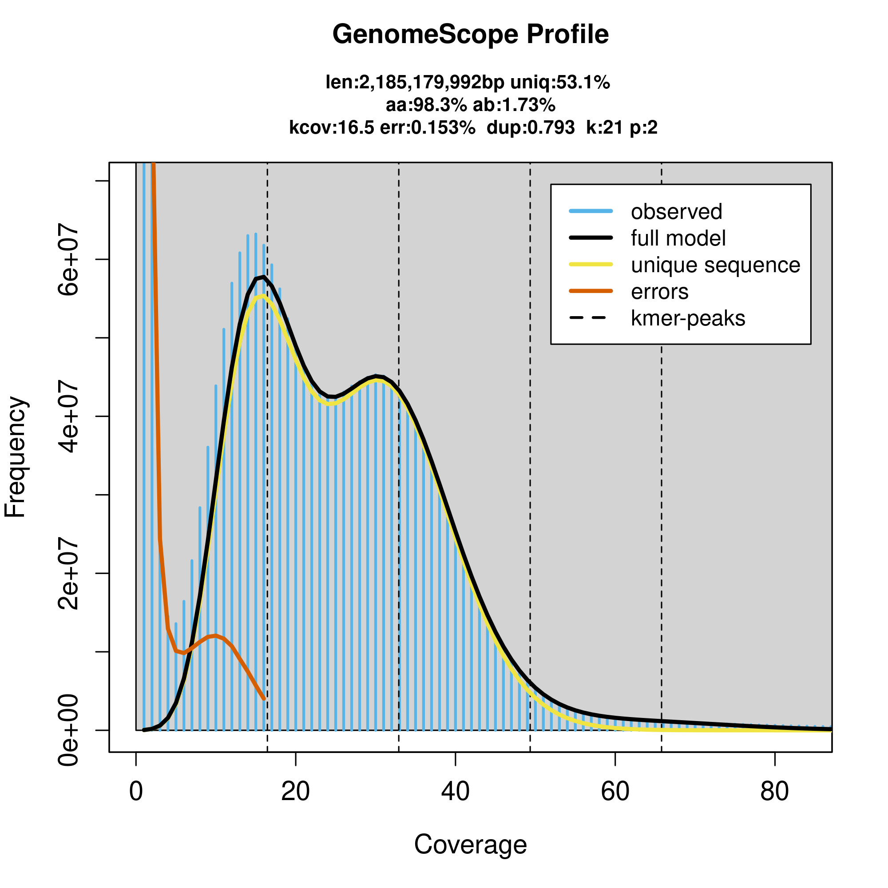

# A Genome Assembly and Annotation Workflow 
#### Authored: Michael Grapin -- Moore Lab Research Technician @ University of Nebraska-Lincoln 


## Directory Content: 
This directory contents important files and metrics for my *Gryllus pennsylvanicus* genome assembly and annotation. 

* [QC Control](#qc-control) 
* [Removing Any Remenant Adapters and Inital Filtration](#removing-any-remenant-adapters-and-inital-filtration)
* [Genome Properties](#genome-properties) 
#### Assembly
* [Inital Assembly](#inital-assembly) 
    - gfastats
* [BlobTools to Remove Contaminants](#blobtools-to-remove-contaminants) 
* [Stats Afters Contaminant Removal](#stats-afters-contaminant-removal) 
    - BUSCO 
    - gfastats 
* [Scaffolding](#scaffolding)
    - gfastats 
    - BUSCO
* [Gap Closing Stats](#gap-closing-stats) 
#### Annotation
* [Repeat Masking](#repeatmasking)
    - Repeat Modeler 
    - DeepTE + TERL 
    - Repeat Masker
    - Masking NUMTs 
* [Structural Annotation](#structural-annotation)
* [Functional Annotation](#functional-annotation)
---

## QC Control 


## Removing Any Remenant Adapters and Initial Filtration 


## Genome Properties 

* Counting 21mers with Meryl 
    - [Genomescope2](http://genomescope.org/genomescope2.0/analysis.php?code=iiaLIgiTJQNYGKf1fIWu)  


  
**Figure:** Gpenn GenomeScope2 Profile      

---

## Inital Assembly 
    - gfastats

## BlobTools to Remove Contaminants 

## Stats Afters Contaminant Removal 
    - BUSCO 
    - gfastats 

## Scaffolding 
    - gfastats 
    - BUSCO

## Gap Closing Stats

# Annotation

## RepeatMasking 
## Results: 
* **Run Parameters**
```RepeatModeler -threads 40 -database Gpenn -numAddlRounds 2```  
*Full Log:* [Log File](./Gpenn-rmod.log)
* **Usage:**  
Cores per node: 40  
CPU Utilized: 28-13:05:25  
CPU Efficiency: 51.04% of 55-22:14:40 core-walltime  
Job Wall-clock time: 1-09:33:22  
Memory Utilized: 89.76 GB  
Memory Efficiency: 89.76% of 100.00 GB (100.00 GB/node)  

* **Round 7:**  
Input Database Coverage: 942550271 bp out of 2104814279 bp **( 44.78 % )**  
Repeat Families Found: 2450  
Classified: 975 **(39.7%)**  
Unknown: 1475 **(60.2%)**  

***Note:*** *Increased the number of rounds was expected to follow a pattern of increasing the sample size*
```
# RepeatModeler v2.0.7
-numAddlRounds 
# Optionally increase the number of rounds. The sample size for additional rounds will change by size multiplier (currently 3).
```
***But by round 7...***
```
RepeatModeler Round # 7
========================
Searching for Repeats
 -- Sampling from the database...
   - Gathering up to 270000000 bp
 ```
 ***It still only grabbed **270,000,000 bp** of sequences. Not sure why this is behaving that way.***

 ### Implementation of ``DeepTE`` and ```TERL```  
 
* DeepTE 
    - Orginal Unknown: 1475
    - Unknown After DeepTE: 411

* TERL 
    - 367 sequences removed based on NonTE classification
    - Unknown After TERL: 97 (No Classification at all)
    - **Final set has 1461 sequences**      

Repeat Families: 2436    
Classified: 2239   **(91.9%)**  
Unknown: 197  **(8.1%)**  


### Repeat Masker
* Final De Novo Custom Repeat Library: 2436 Sequences

```
# Repeat Masker Fasta Headers limited to 50 characters 
# Used to retain just >Scaffold#
awk '/^>/{split($0,a,","); print a[1]; next} {print}' input.fasta > output.fasta

```
**RepeatMasker Output Table:** [Gpenn Table](./Gpenn.ls.v2.nuclear.scaffolds.closed.fa.tbl)  
Generated From the Commad:   
```RepeatMasker -pa $SLURM_CPUS_PER_TASK -gff -s -a -inv -no_is -norna -xsmall -nolow -div 40 -lib $WKDIR/RepeatMM/ML/${SPECIES}_families.prefix.fa.known.unknown.FINAL -cutoff 225 $FASTA```

Produced a total of 861537515 bp masked.

### Masking NUMTs
Following approach used in Liu et al. [2024, Mol Phyl Evol](https://doi.org/10.1016/j.ympev.2024.108221)

Addded a additional 1921673 bp soft masked. 

Total of 863459188 bp masked. 

## Structural Annotation 

## Functional Annotation 
